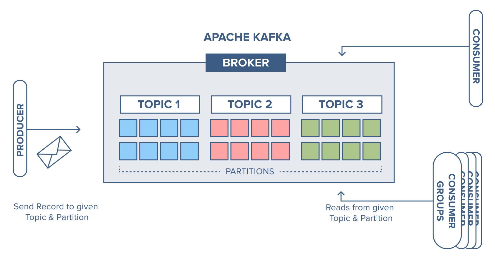
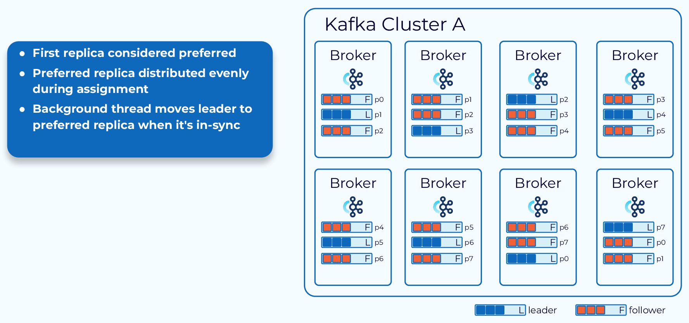

# Kafka Architecture





## What is Apache Kafka?

**Apache Kafka is a distributed event streaming platform used to:**
- Collect real-time data
- Store it durably
- Process and distribute it to multiple systems

👉 Think of Kafka as a high-speed, fault-tolerant message backbone between systems.

## Core Kafka Components (Based on Architecture)
1️⃣ **Producer**  
**Who sends data**
- A Producer is an application that publishes messages (events) to Kafka.
- Producers write data to Topics.
- They don’t talk to consumers directly.
#### 📌 Example:
- IoT device sending sensor data
- Backend service sending logs or events
- Producer → Kafka Topic

2️⃣ **Topic**  
**Logical category of messages**
- A Topic is like a table or folder.
- Messages related to the same purpose go into the same topic.
- Topics are append-only logs.
####📌 Example Topics:
- user-signups
- payments
- iot-temperature

3️⃣ **Partition**  
**How Kafka scales**
- A topic is split into multiple partitions.
- Each partition is an ordered, immutable log.
- Messages inside a partition are ordered, but not across partitions.
#### 📌 Why partitions?
- Parallel processing
- High throughput
- Scalability
```
Topic: payments
├── Partition 0
├── Partition 1
└── Partition 2
```

#### 📌 Key rule:
``` One partition → consumed by only one consumer per consumer group ```

4️⃣ **Broker**  
**Kafka server**
- A Broker is a Kafka server that stores data.
- A Kafka Cluster = multiple brokers.
- Each broker stores partitions of topics.
#### 📌 Example:
```
Kafka Cluster
├── Broker 1
├── Broker 2
└── Broker 3
```
#### Brokers handle:
- Message storage
 - Reads & writes
- Replication

5️⃣ **Replication**   
**Fault tolerance**
- Each partition has replicas across brokers.
- One replica is the Leader
- Others are Followers
#### 📌 Example (Replication factor = 3):
```
Partition 0
├── Leader → Broker 1
├── Follower → Broker 2
└── Follower → Broker 3
```
####📌 Why replication?
- If leader broker fails → a follower becomes leader
- No data loss

6️⃣ **Consumer**  
**Who reads data**
- A Consumer reads messages from topics.
- Consumers pull data (Kafka doesn’t push).
- Consumers track offsets (position in partition).
#### 📌 Example:
- Analytics service
- Notification service
- Data pipeline to Splunk / DB
``` kafka Topic → Consumer ```

7️⃣ **Consumer Group**  
**Parallel processing**
- Consumers belong to a Consumer Group.
- Each partition is consumed by only one consumer in the group.
- Multiple consumer groups can read the same topic independently.
#### 📌 Example:
```
Topic (3 partitions)

Group A:
Consumer 1 → Partition 0
Consumer 2 → Partition 1
Consumer 3 → Partition 2

Group B:
Consumer X → Partition 0
Consumer Y → Partition 1
Consumer Z → Partition 2
```

8️⃣ **Offset
**Message position**
- Each message has an offset (unique number per partition).
- Kafka stores offsets (now in Kafka itself, not ZooKeeper).
#### 📌 Allows:
- Replay data
- Resume after failure

9️⃣ **KRaft (Modern Kafka – ZooKeeper Replacement)**  
**What is KRaft?**
 - KRaft = Kafka Raft Metadata mode
- Kafka uses the Raft consensus algorithm
- No ZooKeeper required
- Metadata is stored inside Kafka itself

**What Changed with KRaft?**
| ZooKeeper Kafka       | KRaft Kafka          |
| --------------------- | -------------------- |
| External ZooKeeper    | No ZooKeeper         |
| Metadata in ZooKeeper | Metadata in Kafka    |
| ZK leader election    | Raft leader election |
| Complex ops           | Simple ops           |
| Two systems           | One system           |

